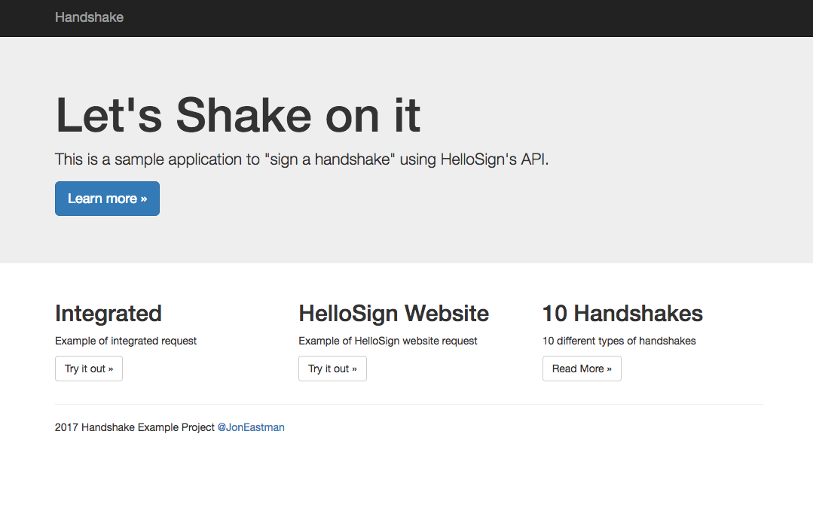

HandShake
=========

A Symfony project created on August 7, 2017, 3:11 pm.

This is a quick example to show how to integrate HelloSign via embedded & using the HelloSign website. (Disclaimer: this app is just an example app & is not meant for production.)

Embedded application integration must follow the HelloSign integration guidelines found at https://www.hellosign.com.

Required parameters.yml (will be prompted during composer install)

hello_sign_api:

hello_sign_client_id:

To acquire a HelloSign API key, sign up for an account. 

You must create a test "App" on the API dashboard to acquire a Client ID. 

